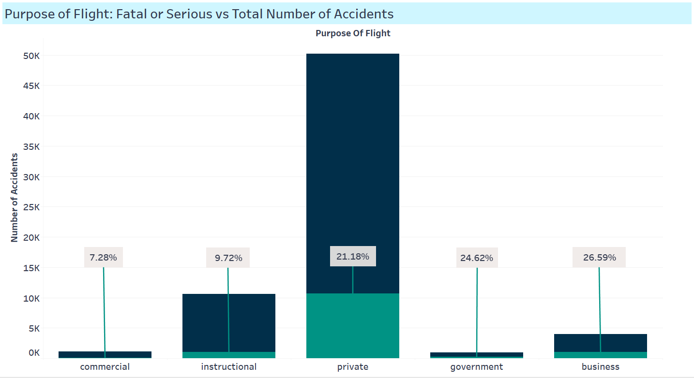
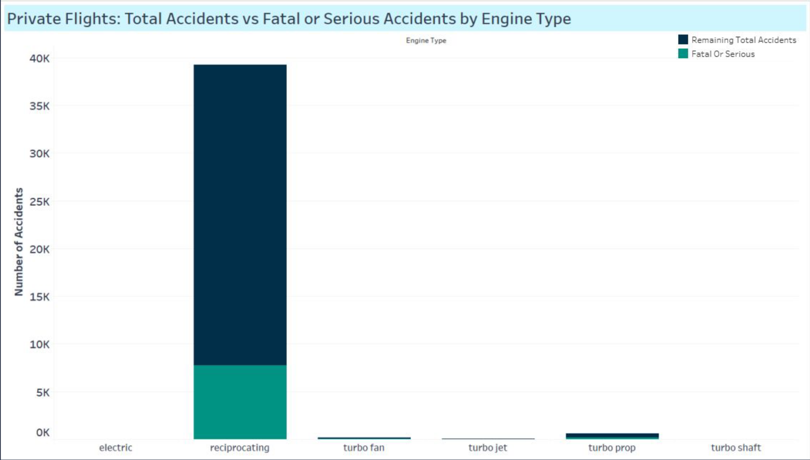
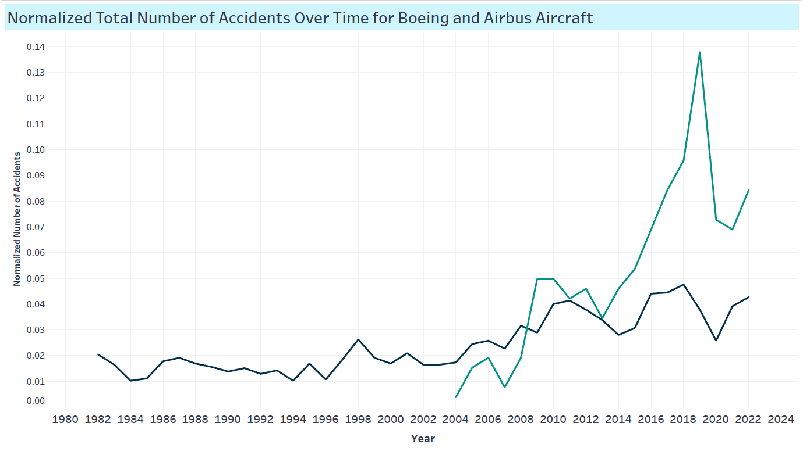

# Avoiding the Crash: Navigating the Skies Safely

**Author**: [Chisum Lindauer](linkedin) and [Emma Scotson](linkedin)

## Overview
Our company is interested in purchasing and operating airplanes for commercial and private enterprises. This Exploratory Data Analysis (EDA) utilizes data from the National Transportation Safety Board to answer 4 key questions on aircraft safety. The analysis contains actionable insights for the head of the new Aviation Division.

## Business Understanding
- **Goal**: Recommend at least 3 actionable insights 
- **Stakeholders**: Head of the new Aviation Division.
- **Key Business Questions**:
  1. Is commercial or private safer?
  2. What are some of the most important features for aircraft safety?
  3. Who makes the safest aircraft?
  4. What is the safest model of aircraft?

## Data Understanding and Analysis
- **Source of Data**: National Transportation Safety Board aviation accident data (1982-2022).
- **Description of Data**: The dataset includes information on aviation accidents and incidents, detailing aspects such as aircraft make and model, engine type, cause of the accident, severity of the accident, and more.

### Visualizations
1. **Accident Frequency by Aircraft Model**:
   
   *Description*: This bar chart shows the number of accidents for each aircraft model, highlighting those with the highest and lowest frequencies.

2. **Causes of Accidents**:
   
   *Description*: This bar chart illustrates the distribution of different causes of aviation accidents, providing insights into the most common factors.

3. **Trend Over Time**:
   
   *Description*: This line graph depicts the trend in aviation accidents over the years, comparing the normalized number of accidents for Boeing and Airbus aircraft.

## Conclusions
This analysis leads to three key recommendations for improving operations at ACME Co.

1. **Commercial flights are significantly safer than private flights**: Regulatory measures and standardized protocols contribute to this safety.
2. **Aircraft with two or more engines are safer**: One-engine aircraft have a much higher accident rate.
3. **Boeing and Airbus are the safest makes**: Both manufacturers show lower incident rates and high reliability.

## Next Steps
To further refine our analysis and provide more comprehensive recommendations, we suggest the following next steps:

- **More Safety Analysis**: Utilize additional data sources to explore more features of aircraft and flight, such as weather conditions, build years, regulations, and locations, to gain better insights into safety.
- **Market Analysis**: Identify profitable services and locations, and understand the growth and timing of different sectors to make informed decisions.
- **Cost Analysis**: Investigate maintenance costs, regulatory costs, fees, taxes, and aircraft costs to determine the profitability of the venture.
- **Analyze Company Strengths**: Leverage internal and external data to identify the company's strengths in the aviation industry.
- **Expand Insights**: Delve into risk management, customer insights, competitive analysis, and compliance to ensure a thorough understanding of the market.

## For More Information
See the full analysis in the [Jupyter Notebook](./aviation-venture-risk-eda.ipynb) or review this [presentation](./presentation.pdf).

For additional info, contact [Chisum Lindauer](linkedin) or Emma Scotson(linkedin)

## Repository Structure
```
├── data
│ ├── AviationData.csv
│ ├── USState_Codes.csv
├── images
│ ├── aviation-venture-risk-eda-header.jpg
│ ├── normalized_boeing_vs_airbus_chart.png
│ ├── private_flights_engine_type_chart.png
│ ├── purpose_of_flight_chart.png
├── tableau_data
│ ├── colors.txt
│ ├── commercial_flights_total_accidents_vs_fatal_or_serious_accidents_by_engine_type.csv
│ ├── Flatiron-Project1-Visualizations-final.twbx
│ ├── graph-1.csv
│ ├── images
│ │ ├── aviation-venture-risk-eda-header.jpg
│ │ ├── normalized_boeing_vs_airbus_chart.png
│ │ ├── private_flights_engine_type_chart.png
│ │ ├── purpose_of_flight_chart.png
│ ├── normalized_total_number_of_accidents_over_time_for_boeing_and_airbus_aircraft.csv
│ ├── private_flights_total_accidents_vs_fatal_or_serious_accidents_by_engine_type.csv
│ ├── purpose_of_flight_accidents.csv
│ ├── Screenshot_2024-05-28_at_5.11.33_PM.png
│ ├── tableau-dashboard-url.txt
│ ├── 'Tableau Dashboard URL.txt'
├── README.md
├── presentation.pdf
└── aviation-venture-risk-eda.ipynb
```