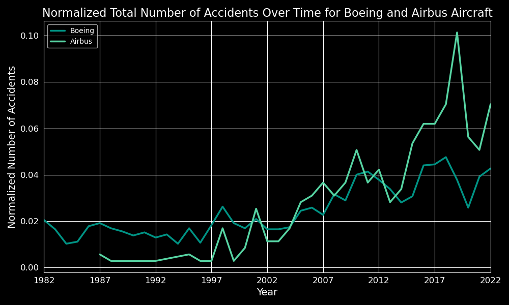

# Avoiding the Crash: Navigating the Skies Safely

**Authors**: [Chisum Lindauer](chisum@atrixtech.com) and [Emma Scotson](emmascotson112@gmail.com)

## Overview
Our company is interested in purchasing and operating airplanes for commercial and private enterprises. This Exploratory Data Analysis (EDA) utilizes data from the National Transportation Safety Board to answer 4 key questions on aircraft safety. The analysis contains actionable insights for the head of the new Aviation Division.

## Business Understanding
- **Goal**: Recommend at least 3 actionable insights 
- **Stakeholders**: Head of the new Aviation Division.
- **Key Business Questions**:
  1. Is commercial or private safer?
  2. What are some of the most important features for aircraft safety?
  3. Who makes the safest aircraft?
  4. What is the safest model of aircraft?

## Data Understanding and Analysis
- **Source of Data**: National Transportation Safety Board aviation accident data (1982-2022).
- **Description of Data**: The dataset includes information on aviation accidents and incidents, detailing aspects such as aircraft make and model, engine type, cause of the accident, severity of the accident, and more.

### Visualizations
1. **Accident Frequency by Purpose of Flight**:
   
   *Description*: This bar chart shows the number of accidents for each purpose of flight.

2. **Engine Types**:
   
   *Description*: This bar chart illustrates reciprocating engines, usually used in private flight, is really risky.  It also shows turbo fan engines are safe.

3. **Trend Over Time Boeing vs Airbus**:
   
   *Description*: This compares Airbus ot Boeing for their safety trends normalized for accident volume by comparing the proportion of serious or fatal accidents to all accidents for each maker.

# Final Conclusions

We defined low-risk as the lowest risk to human life, using the relative fatal or serious to total number of accidents ratio for each feature. This allowed us to normalize and compare different features even if some had more data, such as private flights having far more accidents than commercial flights.

Here are the results of our questions gained from business understanding:

1. **Aircraft Category: Airplane**
   The best low-risk option of aircraft for both private and commercial use is an airplane.

2. **Private or Commercial: Commercial**
   The best low-risk purpose of business for airplane usage is commercial flights.

3. **Features: 2 Engines, Turbofan**
   The best features to include in your airplane model to ensure a low risk of accidents are 2 or more engines, ideally of a turbofan type.

4. **Make: Boeing (Airbus: Runner Up)**
   The manufacturer to purchase aircraft from for the most risk-safe product is Boeing, with Airbus as a runner-up.

5. **Make and Model: Boeing-777**
   The model 777 from Boeing in this data set has the lowest proportion of serious and fatal accidents to total accidents, after filtering out planes that do not have enough data.

6. **Time of Year**
   Summer is more dangerous than Winter, interestingly enough!

7. **Location and Airport Name**
   There is a lack of data to give solid conclusions on this due to the variety of locations and airports. International data sometimes appears safer, like London, but this might be biased by the US-centric dataset. A better approach is needed for this analysis.

8. **Safest Location by Code (US States and Region Codes) for Flights from 2000 Onward**
   Alaska, North Dakota, and Maryland ended up being the safest by our metric, while the Atlantic Ocean was by far the most dangerous.

## Next Steps
To further refine our analysis and provide more comprehensive recommendations, we suggest the following next steps:

- **More Safety Analysis**: Utilize additional data sources to explore more features of aircraft and flight, such as weather conditions, build years, regulations, and locations, to gain better insights into safety.
- **Market Analysis**: Identify profitable services and locations, and understand the growth and timing of different sectors to make informed decisions.
- **Cost Analysis**: Investigate maintenance costs, regulatory costs, fees, taxes, and aircraft costs to determine the profitability of the venture.
- **Analyze Company Strengths**: Leverage internal and external data to identify the company's strengths in the aviation industry.
- **Expand Insights**: Delve into risk management, customer insights, competitive analysis, and compliance to ensure a thorough understanding of the market.

## For More Information
See the full analysis in the [Jupyter Notebook](./aviation-venture-risk-eda.ipynb) or review this [presentation](./presentation.pdf).

Our data is also available in the [data folder](./data/AviationData.csv).

You can also see an interactive dashboard of key charts [here](https://public.tableau.com/app/profile/chisum.lindauer/viz/Flatiron-Project1-Visualizations-final/Dashboard1?publish=yes(learn-env)).

For additional info, contact [Chisum Lindauer](chisum@atrixtech.com) or [Emma Scotson](emmascotson112@gmail.com)